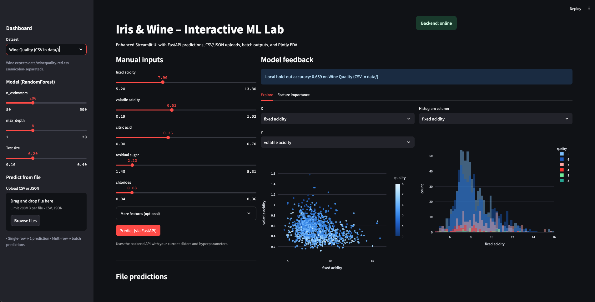

# Mlops_Lab2
=======
# MLOps Lab 2 – Streamlit

This lab demonstrates how to serve a machine learning model with **FastAPI** and build an interactive **Streamlit** dashboard for predictions and exploratory data analysis (EDA).  
The project covers:

- Hosting ML models with FastAPI (Iris & Wine Quality datasets)  
- Adding API key authentication for secure access  
- Integrating Streamlit as a frontend dashboard  
- Supporting CSV/JSON uploads for batch predictions  
- Visualizing results with Plotly  

---

## Setup Instructions

### 1. Clone repository
```bash
git clone https://github.com/Gnanasudharsan/Mlops_Lab2.git
cd Mlops_Lab2
```

### 2. Create virtual environment
```bash
python3 -m venv streamlitenv
source ./streamlitenv/bin/activate   # Mac/Linux
# or
.\streamlitenv\Scriptsctivate      # Windows
```

### 3. Install dependencies
```bash
pip install -r requirements.txt
```

Or minimal install:
```bash
pip install streamlit fastapi uvicorn scikit-learn plotly pandas
```

---

## Configuration

### API Key
For security, the FastAPI backend requires an API key.

**Option A – Environment Variable**
```bash
export API_KEY="your_api_key_here"
```

**Option B – Streamlit Cloud (recommended)**  
Create `.streamlit/secrets.toml` file in your repo:

```toml
API_URL="http://localhost:8000"
API_KEY="your_api_key_here"
```

---

## Running the App

### 1. Start FastAPI backend
```bash
cd Mlops_Lab2
source ./streamlitenv/bin/activate
export API_KEY="your_api_key_here"
export ML_WINE_PATH="data/winequality-red.csv"
uvicorn api.main:app --reload --port 8000
```
Backend will be available at [http://localhost:8000](http://localhost:8000).

Health check:
```bash
curl -H "x-api-key: your_api_key_here" http://localhost:8000/health
```

---

### 2. Start Streamlit frontend
In a second terminal:
```bash
cd Mlops_Lab2
source ./streamlitenv/bin/activate
streamlit run src/Dashboard.py
```
Frontend will be available at [http://localhost:8501](http://localhost:8501).

---

## Screenshots

### Streamlit Dashboard


### FastAPI Docs
Visit [http://localhost:8000/docs](http://localhost:8000/docs) to explore the OpenAPI docs.

---

## References
- [FastAPI Docs](https://fastapi.tiangolo.com/)  
- [Streamlit Docs](https://docs.streamlit.io/)  
- [Scikit-learn](https://scikit-learn.org/)  
